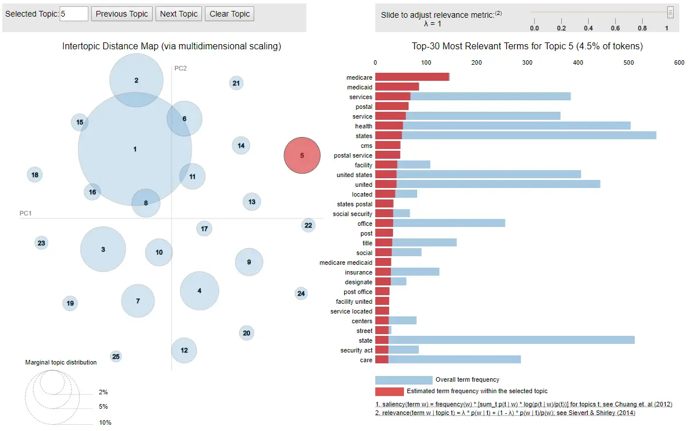
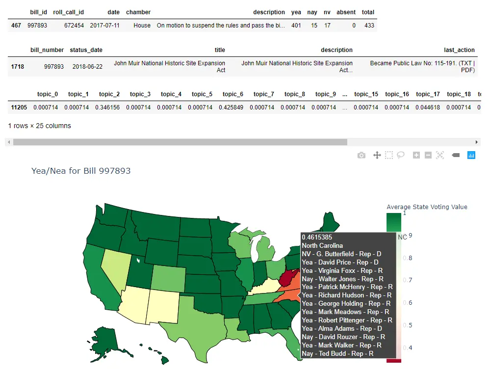
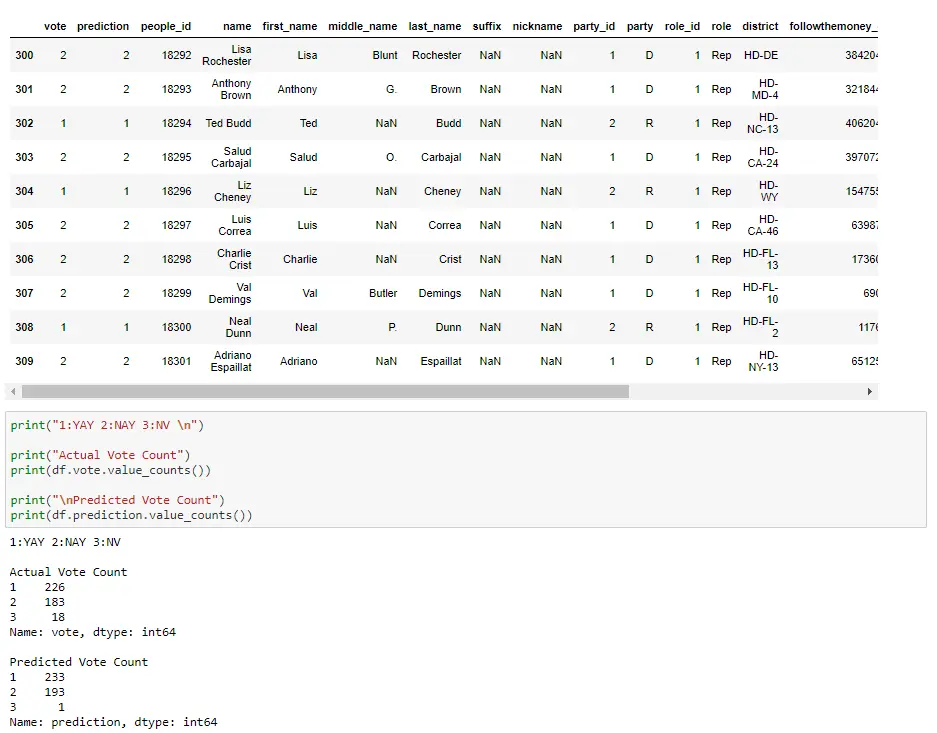

# xEval - Background and History

This background is for the [xeval.io](https://www.xeval.io/) website. A visual description can be found at the [README](../docs/xEval.md).

## Market Research

To understand how people track legislation, we conducted a survey of 20 people in our network. We found that people used various methods to track legislation, with the most common being news sources like Twitter, Facebook, and cable news. Our goal was to provide users with up-to-date information about legislation before these sources, so we explored the websites of the federal and state governments, many of which publish legislation, such as [New Jersey](https://www.njleg.state.nj.us/disclaimer) and [Federal](https://www.congress.gov). However, we found these websites to be user-unfriendly, and we would need to build a web scraper to obtain data from each individual state.

We discovered [Legiscan](https://legiscan.com/), which stores information from different states and provides a limited API for anyone to use. However, when we followed up with our testers, they said that text search was complicated and they found it difficult to use. They told us that they want to track **Topics**, the ideas they care about the most, without having to worry about a text search with includes and excludes. With that in mind, we decided to build xEval, a platform that uses the data from Legiscan to provide users with a more user-friendly way to track the legislation they care about.

## Existing Solutions

In our research, we found several platforms that do similar things, such as [BillTrack50](https://www.billtrack50.com/) and [PolicyEngage](https://policyengage.com/). However, both of these platforms require a subscription to access customizable alerts. We wanted to provide a free service that would allow users to track legislation without having to pay for it. Our goal was to target the freemium model, where users can use the service for free but have the option to pay for more features.

## Minimum Viable Product (MVP)

We simulated what xEval would do for potential users by speaking to our testers and asking them what **Topics** they wanted to track. We found that they wanted to track topics such as Healthcare, Employment Laws, Gambling, and Covid. One user even wanted to track legislation around gas generators for emergency power.

Every day, we searched on [Legiscan](https://legiscan.com/) for legislation related to the topics our testers wanted to track. We would go through the Legiscan keyword search and edit and modify the search until we found all the legislation related to the topic. We would then send the results to our testers and ask them about the quality of the results. We would modify the search the next day and send the bills we found again until we found the keywords that gave the best results.

## Website

This method turned those **Topics** into high-quality  **Alerts**. An  **Alert** is a combination of keywords used to search for legislation. This meant that after refining our keyword search with Legiscan, we could offer these premade alerts to users, allowing them to track legislation without worrying about the search. Since the search was done using keywords, we could also offer users the ability to create their own alerts using custom keywords.

We decided to build a web app that would allow users to create an account and create their alerts. We would then send them an email every day with the legislation that matched their alerts. Users could also create their own alerts using custom keywords.

## Frontend

The user interface was built using Bootstrap, HTML, JS, and CSS. Bootstrap was used to create a responsive design that would work on all devices. HTML and JS were used to create the forms and buttons that would allow users to create their own alerts. HTML was also used to create the email template that would be sent to users every day with the legislation that matched their alerts. A summary of the appearance is shown in the about [README](../docs/xEval.md).

## Backend

Our backend consisted of three main components. First, a MySQL Database containing various tables for our Users, Bills, and Alerts. Second, a daily download of all legislation with changes from Legiscan. Third, a script that would check all of our users' alerts and send them an email if any of the bills matched their alerts. This process allows us to provide an automated way for our users get legislation alerts, but we wanted to go a step further.

## Data Science

We used machine learning practices to provide users with two features that enhance the bills they receive and the alerts they create. These services were hosted on AWS EC2 in a microservices architecture using docker-compose.

* User Similarity - Compute one-hot vectors for users and use KDTree to find similar users
* Bill Similarity - Compute text embeddings for bills and use KDTree to find similar bills
* Keyword Suggestions - Offer suggestions for keywords to use in alerts
* Recommendation System - Suggest bills to users based on their bill viewing history and similar users
* Portainer - Manage the docker containers above and view logs remotely

### Recommendation System

A weekly recap was created to show users a history of their alerts in addition to showing them other bills they might be interested in. This required the creation of a recommendation system. We envisioned using both collaborative and content-based filtering in a hybrid system. This meant we needed a way to compare similarity of both our users and the bills. For the bills, we used [Doc2Vec](https://radimrehurek.com/gensim/models/doc2vec.html) to create text embeddings and used [KDTree](https://scikit-learn.org/stable/modules/generated/sklearn.neighbors.KDTree.html) to sort by Euclidean distance. For the users, we created a one-hot vector of the bills they had viewed and used KDTree to sort by Euclidean distance to find the bills that similar users had viewed. We took the top 5 bills from both those lists and combined them to create a list of 10 bills that we would recommend to the user.

Keyword suggestions were also created to help us create the alerts in addition to helping users create their own alerts. This was done in two parts. First, we used the bills' word count (Term-Frequency TF) to see the most used words. We were then able to identify common keywords amongst those bills using Latent Dirichlet Allocation (LDA). To create the suggestion for our users, we used a [FastText](https://fasttext.cc/docs/en/unsupervised-tutorial.html) model (and preprocessed text) which we would search nearest neighbors for the keywords. We would return the top 5 keywords and display them to the user to add.

## Usage

During the one year of development, here are our stats: 13 premade alerts, 103 user-made alerts, 235k bills analyzed, and 9460 alerts sent. In terms of web traffic, we had a high of approximately 50 daily visits and approximately 15 accounts created. Our biggest move was providing a recent bills widget to a Cannabis Website, which allowed us to get our name out there and gain some traction. However, not much came of it in terms of users.

## Stories of Usage

One success story involved a user who wanted to track legislation around gas generators for emergency power. This user was a manager at a company that provided emergency power to hospitals and other critical infrastructure. One day, early in development, we came across a Hawaii bill that required all schools to have backup power. Since the user was in sales, they were able to reach out to the schools and offer a solution on the same day the legislation came out. This was a great example of how our service could be used to track legislation and provide a competitive advantage.

## Future

This project has since been put on hold but here are some of the features we did some basic research on:

### Bill Vote Predicition

# Thanks for Reading

If you have any questions or comments please feel free to reach out to me.
